## The Data Analytics in Financial Audits Paper Collection

The **Data Analytics in Financial Audits and Accounting Paper Collection** is a collection of academic publications that demonstrate the application of data analytics, machine learning, and deep learning techniques in the context of financial (statement) audits. The collected publications thereby focus on the analysis of transactional accounting data contained in Enterprise Ressource Planning (ERP) systems (such as SAP FI and/or Oracle Financials) usually examined in such audits. 

The setup up of the collection is currently 'work in progress'. Therefore, please don't expect an all-encompassing list of papers at this point.  If you want to have an article added or removed, please send an email to me via marco dot schreyer at unisg dot ch.

 

<table> <tbody> <tr> <td align="left" width=250>
<a href="https://www.dfki.de/en/web/research/projects-and-publications/projects/project/spotted/">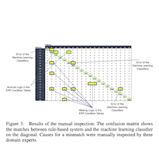</a></td>
<td align="left" width=550><b>"Utilizing Machine Learning Techniques to Reveal VAT Compliance Violations in Accounting Data"</b> 
Johannes Lahann, 
Martin Scheid, 
and, Peter Fettke 
In IEEE 21st Conference on Business Informatics (CBI), 2019 
<a href="https://ieeexplore.ieee.org/document/8808015">[Paper]</a> 
<a href="https://www.dfki.de/en/web/research/projects-and-publications/projects/project/spotted/">[Project]</a>
</td></tr></tbody></table>

<table> <tbody> <tr> <td align="left" width=250>
<a href="https://github.com/GitiHubi/deepAD">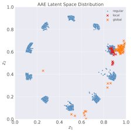</a></td>
<td align="left" width=550><b>"Detection of Accounting Anomalies in the Latent Space using Adversarial Autoencoder Neural Networks"</b> 
Marco Schreyer, 
 Timur Sattarov, 
 Christian Schulze, 
 Bernd Reimer, 
and,  Damian Borth 
In 25th Conference on Knowledge Discovery and Data Mining (KDD) - 2nd Workshop on Anomaly Detection in Finance, 2019 
<a href="https://arxiv.org/pdf/1908.00734">[Paper]</a> 
<a href="https://github.com/GitiHubi/deepAD">[Project]</a>
</td></tr></tbody></table>

<table> <tbody> <tr> <td align="left" width=250>
<a href="https://github.com/GitiHubi/deepAI">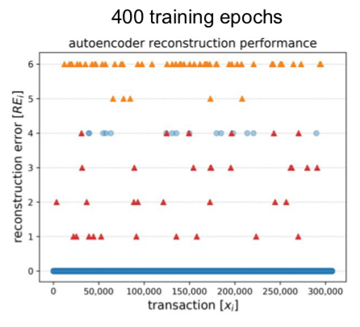</a></td>
<td align="left" width=550><b>"Detection of Anomalies in Large-Scale Accounting Data using Deep Autoencoder Networks"</b> 
Marco Schreyer, 
 Timur Sattarov, 
 Damian Borth, 
 Andreas Dengel, 
and,  Bernd Reimer 
In arXiv.org e-Print archive, 2017 
<a href="https://arxiv.org/pdf/1709.05254">[Paper]</a> 
<a href="https://github.com/GitiHubi/deepAI">[Project]</a>
</td></tr></tbody></table>

<table> <tbody> <tr> <td align="left" width=250>
<a href="-">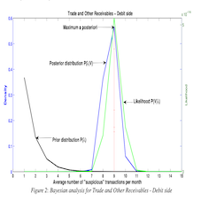</a></td>
<td align="left" width=550><b>"Auditing Journal Entries Using Extreme Vale Theory"</b> 
Argyris Argyrou 
In 21st European Conference on Information Systems, 2013 
<a href="https://pdfs.semanticscholar.org/191d/09d88c0013fbd5d3cf6f608bc3a4363b38db.pdf">[Paper]</a> 
<a href="-">[Project]</a>
</td></tr></tbody></table>

<table> <tbody> <tr> <td align="left" width=250>
<a href="-">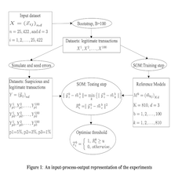</a></td>
<td align="left" width=550><b>"Auditing Journal Entries Using Self-Organizing Map"</b> 
Argyris Argyrou 
In 18th Americas Conference on Information Systems (AMCIS), 2012 
<a href="https://pdfs.semanticscholar.org/898c/d58614cdadd5e6e2507cad79e8e37c6ba5e5.pdf">[Paper]</a> 
<a href="-">[Project]</a>
</td></tr></tbody></table>

<table> <tbody> <tr> <td align="left" width=250>
<a href="-">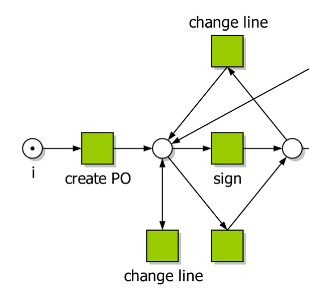</a></td>
<td align="left" width=550><b>"A Business Process Mining Application for Internal Transaction Fraud Mitigation"</b> 
Mike Jans, 
 Jan Martijn Van Der Werf, 
 Nadine Lybaert, 
and,  Koen Vanhoof 
In Expert Systems with Applications 38, 2011 
<a href="http://isiarticles.com/bundles/Article/pre/pdf/9350.pdf">[Paper]</a> 
<a href="-">[Project]</a>
</td></tr></tbody></table>

<table> <tbody> <tr> <td align="left" width=250>
</td>
<td align="left" width=550><b>"Data Mining Journal Entries for Fraud Detection: An Exploratory Study"</b> 
Roger S. Debreceny, 
and,  Glen L. Gray  
In International Journal of Accounting Information Systems, 2010 
<a href="https://www.sciencedirect.com/science/article/pii/S1467089510000540">[Paper]</a> 
<a href="-">[Project]</a>
</td></tr></tbody></table>

<table> <tbody> <tr> <td align="left" width=250>
<a href="-">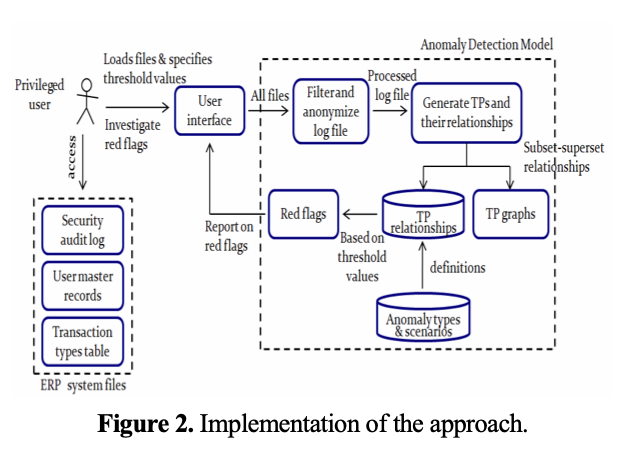</a></td>
<td align="left" width=550><b>"Transaction Mining for Fraud Detection in ERP Systems"</b> 
Roheena Q. Khan, 
 Malcolm Corney, 
 Andrew J. Clark, 
and,  George M. Mohay  
In Industrial Engineering and Management Systems 9 , 2010 
<a href="https://pdfs.semanticscholar.org/7718/5ac9267f211981dd484452c14d9042804b80.pdf">[Paper]</a> 
<a href="-">[Project]</a>
</td></tr></tbody></table>

<table> <tbody> <tr> <td align="left" width=250>
<a href="-">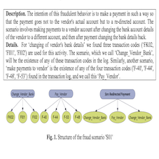</a></td>
<td align="left" width=550><b>"Fraud detection in ERP systems using Scenario matching"</b> 
Asadul K. Islam, 
 Malcolm Corney, 
 George Mohay, 
 Andrew Clark, 
 Shane Bracher, 
 Tobias Raub, 
and,  Ulrich Flegel  
In IFIP Advances in Information and Communication Technology 330 , 2010 
<a href="https://hal.inria.fr/hal-01054523/PDF/10-Paper-177-Fraud_Detection_in_ERP_Systems_using_Scenario_Matching-Asadul_Khandoker_Islam.pdf">[Paper]</a> 
<a href="-">[Project]</a>
</td></tr></tbody></table>

<table> <tbody> <tr> <td align="left" width=250>
<a href="-">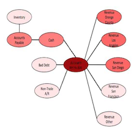</a></td>
<td align="left" width=550><b>"SNARE: A Link Analytic System for Graph Labeling and Risk Detection"</b> 
Mary McGlohon, 
 Stephan Bay, 
 Markus G. Anderle, 
 David M. Steier, 
and,  Christos Faloutsos 
In 15th Conference on Knowledge Discovery and Data Mining (KDD) - Research Track, 2009 
<a href="https://www.cs.cmu.edu/afs/cs.cmu.edu/Web/People/mmcgloho/pubs/snare.pdf">[Paper]</a> 
<a href="-">[Project]</a>
</td></tr></tbody></table>

<table> <tbody> <tr> <td align="left" width=250>
<a href="-">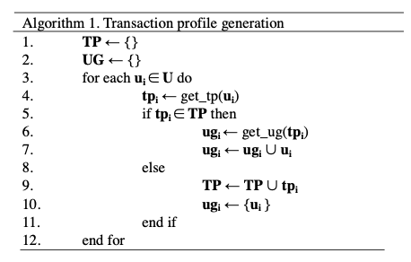</a></td>
<td align="left" width=550><b>"A Role Mining Inspired Approach to Representing User Behaviour in ERP Systems"</b> 
Roheena Q. Khan, 
and,  Malcolm Corney  
In 10th Asia Pacific Industrial Engineering and Management Systems Conference , 2009 
<a href="http://citeseerx.ist.psu.edu/viewdoc/download?doi=10.1.1.616.6828&rep=rep1&type=pdf">[Paper]</a> 
<a href="-">[Project]</a>
</td></tr></tbody></table>

<table> <tbody> <tr> <td align="left" width=250>
<a href="-">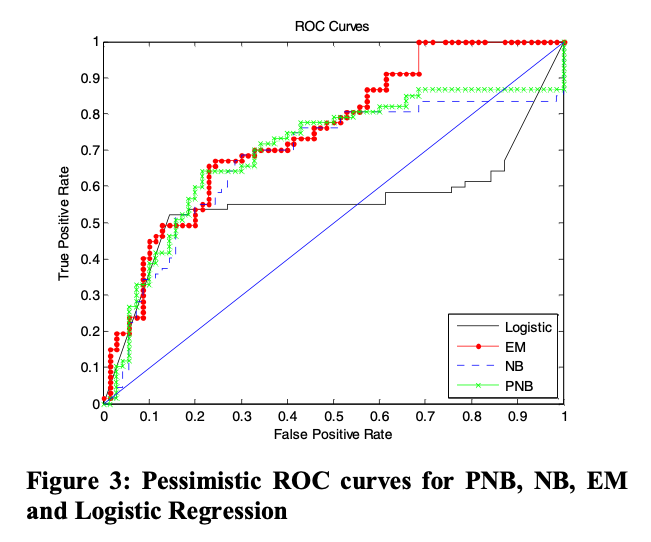</a></td>
<td align="left" width=550><b>"Large Scale Detection of Irregularities in Accounting Data"</b> 
Stephan Bay, 
 Krishna Kumaraswamy, 
 Markus G. Anderle, 
 Rohlt Kumar, 
and,  David M. Steier  
In 6th International Conference on Data Mining (ICDM), 2006 
<a href="http://citeseerx.ist.psu.edu/viewdoc/download?doi=10.1.1.83.2039&rep=rep1&type=pdf">[Paper]</a> 
<a href="-">[Project]</a>
</td></tr></tbody></table>

 

Last updated in Jan 2020 , based on an idea of [Jun-Yan Zhu](http://www.eecs.berkeley.edu/~junyanz/).
 

