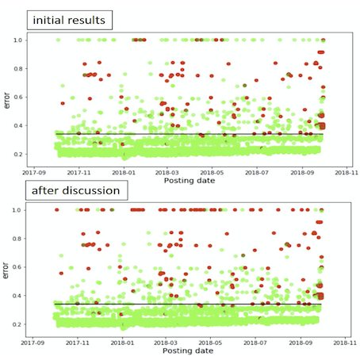
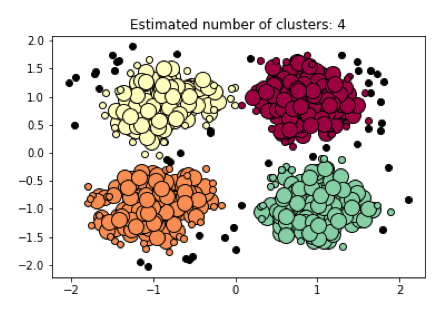
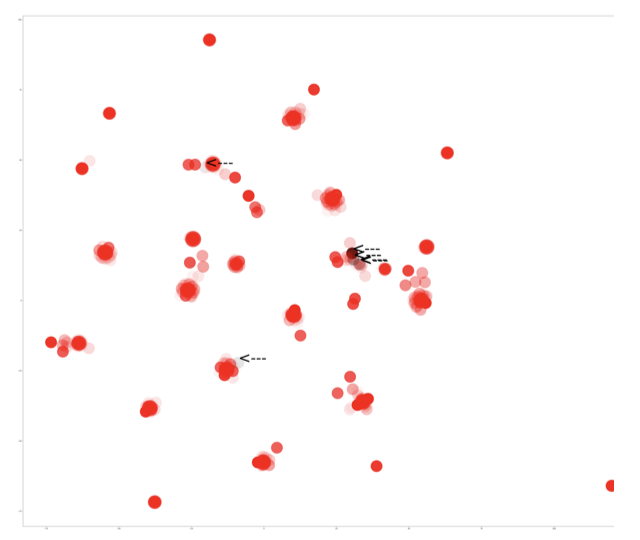
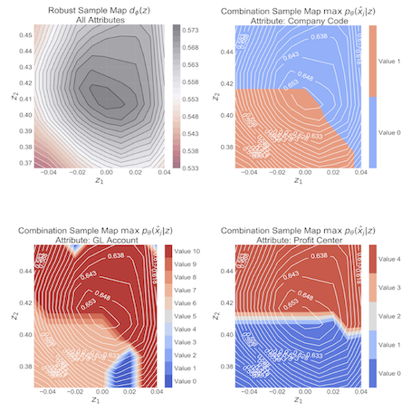
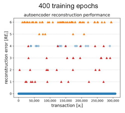
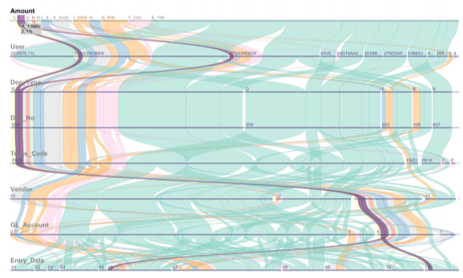
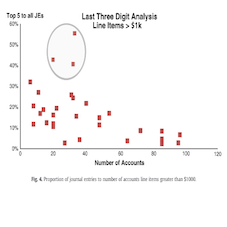

## Financial Audits :: Data Analytics :: Paper Collection

The **Financial Audit Data Analytics Paper Collection** is an academic paper collection that encompasses data analytics, machine learning, and deep learning papers that produce experimental results related to the **audit of financial accounting data**. 

  

If you want me to add or remove an article, please send an email to **marco dot schreyer at unisg dot ch**. The setup up of the paper collection is currently 'work in progress'. Therefore, please don't expect an all-encompassing list of papers at this point :)

## List of Selected Papers: 

 

<table> <tbody> <tr> <td align="left" width=250>
</td>
<td align="left" width=550><b>'Autoencoder Neural Networks versus External Auditors: Detecting Unusual Journal Entries in Financial Statement Audits'</b> 
Martin Schultz, 
and  Marina Tropmann-Frick 
In 53rd Hawaii International Conference on System Sciences (HICSS), Manoa, USA, 2020 
<a href="https://scholarspace.manoa.hawaii.edu/bitstream/10125/64408/1/0536.pdf">[Paper]</a> 
</td></tr></tbody></table>

<table> <tbody> <tr> <td align="left" width=250>
</td>
<td align="left" width=550><b>'A Semi-Supervised Machine Learning Approach to Detect Anomalies in Big Accounting Data'</b> 
Indranil Bhattacharya, 
and  Edo Roos Lindgreen 
European Conference on Information Systems (ECIS), Marrakech, Morocco, 2020 
<a href="https://aisel.aisnet.org/cgi/viewcontent.cgi?article=1099&context=ecis2020_rp">[Paper]</a> 
</td></tr></tbody></table>

<table> <tbody> <tr> <td align="left" width=250>
</td>
<td align="left" width=550><b>'Accounting Journal Reconstruction with Variational Autoencoders and Long Short-term Memory Architecture'</b> 
Mario Zupan, 
 Svjetlana Letinic, 
and  Verica Budimir 
28th Symposium on Advanced Database Systems (SEBD), Villasimius, Italy, 2020 
<a href="https://sebd2020.unica.it/proceedings/05-paper.pdf">[Paper]</a> 
</td></tr></tbody></table>

<table> <tbody> <tr> <td align="left" width=250>
</td>
<td align="left" width=550><b>'Utilizing Machine Learning Techniques to Reveal VAT Compliance Violations in Accounting Data'</b> 
Johannes Lahann, 
 Martin Scheid, 
and  Peter Fettke 
IEEE 21st Conference on Business Informatics (CBI), Moscow, Russia, 2019 
<a href="https://ieeexplore.ieee.org/document/8808015">[Paper]</a> 
<a href="https://www.dfki.de/en/web/research/projects-and-publications/projects/project/spotted/">[Project]</a>
</td></tr></tbody></table>

<table> <tbody> <tr> <td align="left" width=250>
</td>
<td align="left" width=550><b>'Adversarial Learning of Deepfakes in Accounting'</b> 
Marco Schreyer, 
 Timur Sattarov, 
 Bernd Reimer, 
and  Damian Borth 
Advances in Neural Information Processing Systems 32 (NeurIPS) - Workshop on Robust AI in Financial Services, Vancouver, Canada, 2019 
<a href="https://arxiv.org/pdf/1910.03810">[Paper]</a> 
</td></tr></tbody></table>

<table> <tbody> <tr> <td align="left" width=250>
</td>
<td align="left" width=550><b>'Detection of Accounting Anomalies in the Latent Space using Adversarial Autoencoder Neural Networks'</b> 
Marco Schreyer, 
 Timur Sattarov, 
 Christian Schulze, 
 Bernd Reimer, 
and  Damian Borth 
25th Conference on Knowledge Discovery and Data Mining (KDD) - 2nd Workshop on Anomaly Detection in Finance, Anchorage, USA, 2019 
<a href="https://arxiv.org/pdf/1908.00734">[Paper]</a> 
<a href="https://github.com/GitiHubi/deepAD">[Project]</a>
</td></tr></tbody></table>

<table> <tbody> <tr> <td align="left" width=250>
</td>
<td align="left" width=550><b>'Detection of Anomalies in Large-Scale Accounting Data using Deep Autoencoder Networks '</b> 
Marco Schreyer, 
 Timur Sattarov, 
 Damian Borth, 
 Andreas Dengel, 
and  Bernd Reimer 
Nvidias GPU Technology Conference (GTC) - Financial Services Track, San Jose, USA, 2017 
<a href="https://arxiv.org/pdf/1709.05254">[Paper]</a> 
<a href="https://github.com/GitiHubi/deepAI">[Project]</a>
</td></tr></tbody></table>

<table> <tbody> <tr> <td align="left" width=250>
</td>
<td align="left" width=550><b>'Visual Exploration of Journal Entries to Detect Accounting Irregularities and Fraud'</b> 
Andrada Tatu, 
 Marco Schreyer, 
 Jan Hagelauer, 
and  Jixuan Wang 
IEEE VIS 2014 Workshop - Information Visualization and Visual Analytics in Business, Paris, France, 2014 
<a href="http://entsci.gatech.edu/businessvis14/">[Paper]</a> 
</td></tr></tbody></table>

<table> <tbody> <tr> <td align="left" width=250>
</td>
<td align="left" width=550><b>'Auditing Journal Entries Using Extreme Vale Theory'</b> 
Argyris Argyrou 
21st European Conference on Information Systems (ECIS), Utrecht, Netherlands, 2013 
<a href="https://pdfs.semanticscholar.org/191d/09d88c0013fbd5d3cf6f608bc3a4363b38db.pdf">[Paper]</a> 
</td></tr></tbody></table>

<table> <tbody> <tr> <td align="left" width=250>
</td>
<td align="left" width=550><b>'Auditing Journal Entries Using Self-Organizing Map'</b> 
Argyris Argyrou 
18th Americas Conference on Information Systems (AMCIS), Seattle, USA, 2012 
<a href="https://pdfs.semanticscholar.org/898c/d58614cdadd5e6e2507cad79e8e37c6ba5e5.pdf">[Paper]</a> 
</td></tr></tbody></table>

<table> <tbody> <tr> <td align="left" width=250>
</td>
<td align="left" width=550><b>'A Business Process Mining Application for Internal Transaction Fraud Mitigation'</b> 
Mike Jans, 
 Jan Martijn Van Der Werf, 
 Nadine Lybaert, 
and  Koen Vanhoof 
In Expert Systems with Applications 38, 2011 
<a href="http://isiarticles.com/bundles/Article/pre/pdf/9350.pdf">[Paper]</a> 
</td></tr></tbody></table>

<table> <tbody> <tr> <td align="left" width=250>
</td>
<td align="left" width=550><b>'Data Mining Journal Entries for Fraud Detection: An Exploratory Study'</b> 
Roger S. Debreceny, 
and  Glen L. Gray  
In International Journal of Accounting Information Systems, 2010 
<a href="https://www.sciencedirect.com/science/article/pii/S1467089510000540">[Paper]</a> 
</td></tr></tbody></table>

<table> <tbody> <tr> <td align="left" width=250>
</td>
<td align="left" width=550><b>'Transaction Mining for Fraud Detection in ERP Systems '</b> 
Roheena Q. Khan, 
 Malcolm Corney, 
 Andrew J. Clark, 
and  George M. Mohay  
In Industrial Engineering and Management Systems 9, 2010 
<a href="https://pdfs.semanticscholar.org/7718/5ac9267f211981dd484452c14d9042804b80.pdf">[Paper]</a> 
</td></tr></tbody></table>

<table> <tbody> <tr> <td align="left" width=250>
</td>
<td align="left" width=550><b>'Fraud detection in ERP systems using Scenario matching '</b> 
Asadul K. Islam, 
 Malcolm Corney, 
 George Mohay, 
 Andrew Clark, 
 Shane Bracher, 
 Tobias Raub, 
and  Ulrich Flegel  
In IFIP Advances in Information and Communication Technology 330, 2010 
<a href="https://hal.inria.fr/hal-01054523/PDF/10-Paper-177-Fraud_Detection_in_ERP_Systems_using_Scenario_Matching-Asadul_Khandoker_Islam.pdf">[Paper]</a> 
</td></tr></tbody></table>

<table> <tbody> <tr> <td align="left" width=250>
</td>
<td align="left" width=550><b>'SNARE: A Link Analytic System for Graph Labeling and Risk Detection'</b> 
Mary McGlohon, 
 Stephan Bay, 
 Markus G. Anderle, 
 David M. Steier, 
and  Christos Faloutsos 
15th Conference on Knowledge Discovery and Data Mining (KDD) - Research Track, Paris, France, 2009 
<a href="https://www.cs.cmu.edu/afs/cs.cmu.edu/Web/People/mmcgloho/pubs/snare.pdf">[Paper]</a> 
</td></tr></tbody></table>

<table> <tbody> <tr> <td align="left" width=250>
</td>
<td align="left" width=550><b>'A Role Mining Inspired Approach to Representing User Behaviour in ERP Systems'</b> 
Roheena Q. Khan, 
and  Malcolm Corney  
10th Asia Pacific Industrial Engineering and Management Systems Conference (APIEMS), Kitakyushu, Japan, 2009 
<a href="http://citeseerx.ist.psu.edu/viewdoc/download?doi=10.1.1.616.6828&rep=rep1&type=pdf">[Paper]</a> 
</td></tr></tbody></table>

<table> <tbody> <tr> <td align="left" width=250>
</td>
<td align="left" width=550><b>'Large Scale Detection of Irregularities in Accounting Data'</b> 
Stephan Bay, 
 Krishna Kumaraswamy, 
 Markus G. Anderle, 
 Rohlt Kumar, 
and  David M. Steier  
6th International Conference on Data Mining (ICDM), Hong Kong, China, 2006 
<a href="http://citeseerx.ist.psu.edu/viewdoc/download?doi=10.1.1.83.2039&rep=rep1&type=pdf">[Paper]</a> 
</td></tr></tbody></table>

 

Last updated in Jul 2020, based on an idea of [Jun-Yan Zhu](http://www.eecs.berkeley.edu/~junyanz/).
 

